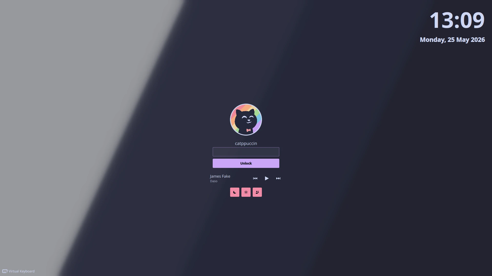
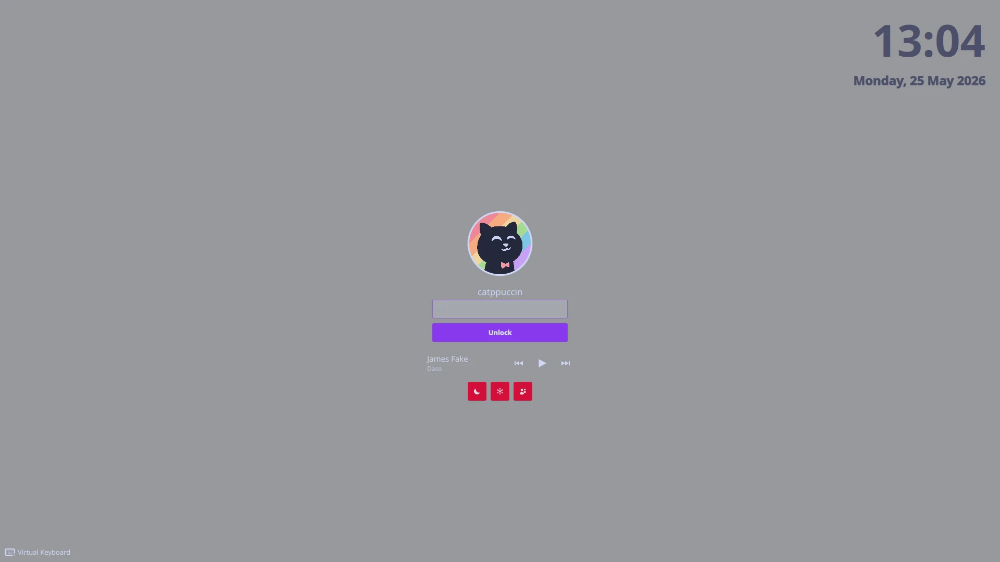
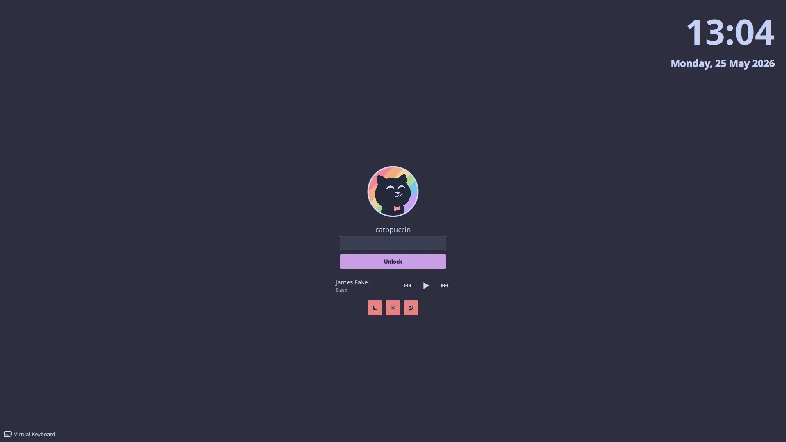
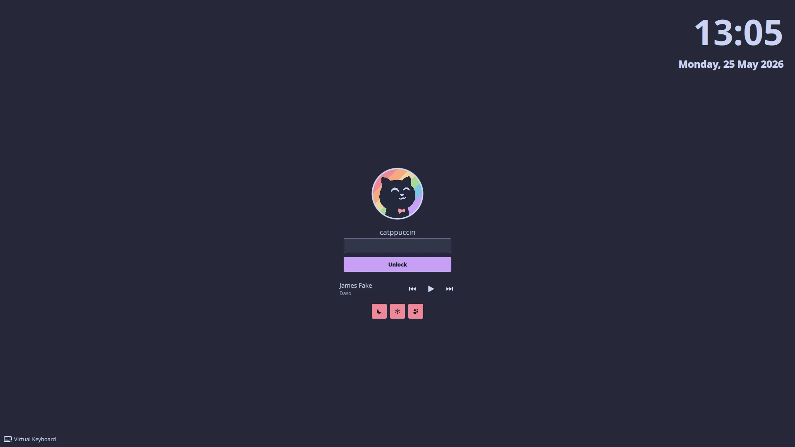
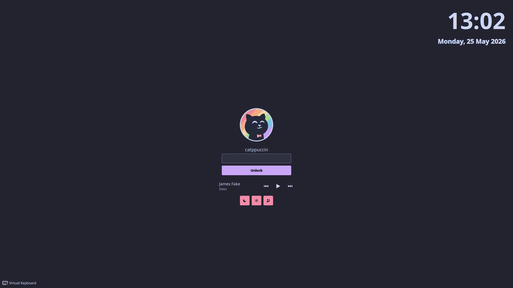

<!--
SPDX-FileCopyrightText: 2025 Alejandro Salazar <alejandro.s@berkeley.edu>
SPDX-License-Identifier: GPL-2.0-or-later
-->

<h3 align="center">
	<br/>
	
	Catppuccin for <a href="https://invent.kde.org/plasma/kscreenlocker">KDE Plasma Lock Screen</a>
	
</h3>

<p align="center">
	<a href="https://github.com/The-Best-Joke/catppuccin-kscreenlocker/stargazers"></a>
	<a href="https://github.com/The-Best-Joke/catppuccin-kscreenlocker/issues"></a>
	<a href="https://github.com/The-Best-Joke/catppuccin-kscreenlocker/contributors"></a>
</p>

<p align="center">
	
</p>

## Previews

<details>
	<summary>🌻 Latte</summary>
	
</details>
<details>
	<summary>🪴 Frappé</summary>
	
</details>
<details>
	<summary>🌺 Macchiato</summary>
	
</details>
<details>
	<summary>🌿 Mocha</summary>
	
</details>

## Usage

1. Ensure you have the [dependencies](#dependencies) for your distribution.
2. Clone this repository:

	```bash
	git clone https://github.com/The-Best-Joke/catppuccin-kscreenlocker.git
	cd catppuccin-kscreenlocker
	```

3. (Optional) Preview a flavour + accent in a window before touching the system:

	```bash
	./install.sh --test
	```

4. Install. This overwrites the system lockscreen at
	`/usr/share/plasma/shells/org.kde.plasma.desktop/contents/lockscreen/`,
	so `sudo` is required. The original is backed up to `lockscreen.bak`
	on first install.

	```bash
	./install.sh --apply
	```

	Or non-interactively:

	```bash
	./install.sh --flavor mocha --accent mauve --apply
	```

5. Lock the screen to see the new theme.

To restore the original lockscreen:

```bash
./install.sh --uninstall --apply
```

> Do **not** apply this package with `lookandfeeltool` / `plasma-apply-lookandfeel`.
> Those tools replace your entire global theme (colour scheme, window
> decoration, icons, cursor, splash) with whatever the package ships. We
> ship only a lock screen, so doing so would reset every other theming
> surface on your desktop. The `install.sh --apply` path above is the
> correct install method.

## Dependencies

### Arch Based OS

```bash
pacman -Syu plasma-workspace kscreenlocker qt6-svg qt6-declarative
```

### Debian / Ubuntu

```bash
apt install plasma-workspace kscreenlocker libqt6svg6 qml6-module-org-kde-kirigami-platform
```

### Fedora / RPM Based OS

```bash
dnf install plasma-workspace kscreenlocker qt6-qtsvg qt6-qtdeclarative
```

### Solus OS

```bash
eopkg install plasma-workspace kscreenlocker qt6-svg qt6-declarative
```

### NixOS

This theme is not yet packaged in nixpkgs. Install manually with
`./install.sh --apply` on a Plasma 6 system, or contribute a package.

## Configuration

KDE's built-in screen-locking settings drive the "show clock" and "show
media controls" toggles. Adjust them under **System Settings → Workspace
→ Screen Locking**.

Everything else lives in `contents/lockscreen/ThemeUserConfig.qml`:

- `fontFamily`: Font family for all lockscreen text. Empty string (`""`)
	uses the Plasma system font. For the intended look, install
	[JetBrains Mono Nerd Font](https://github.com/ryanoasis/nerd-fonts/releases)
	and set this to `"JetBrainsMono Nerd Font"`. Any installed family name works.
- `showLayoutLabel`: Show the keyboard-layout label (only appears with
	more than one configured layout). `true` or `false`.
- `showUserImage`: Show the user's avatar image. `true` or `false`.

Edit the file in your clone and re-run `./install.sh --apply` to push
changes through. Editing the installed copy under `/usr/share/...`
directly works but requires `sudo` and is overwritten on the next install.

## 💝 Thanks to

- [Alejandro Salazar](https://github.com/The-Best-Joke)
- Anthropic's [Claude](https://www.anthropic.com/claude) — collaborator on the installer and the underlying kscreenlocker investigation

&nbsp;

<p align="center">
	
</p>

<p align="center">
	Copyright &copy; 2025-present <a href="https://github.com/The-Best-Joke" target="_blank">Alejandro Salazar</a>
</p>

<p align="center">
	<a href="LICENSE"></a>
</p>
